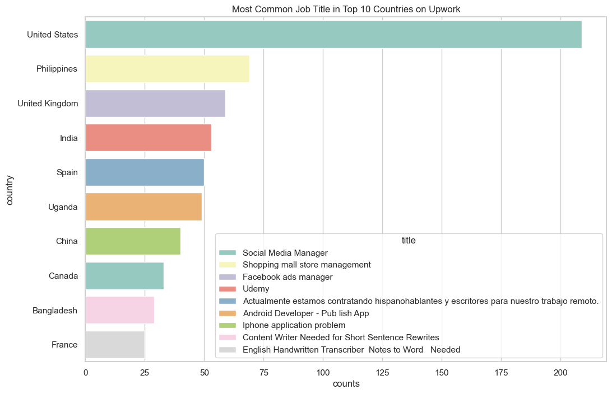
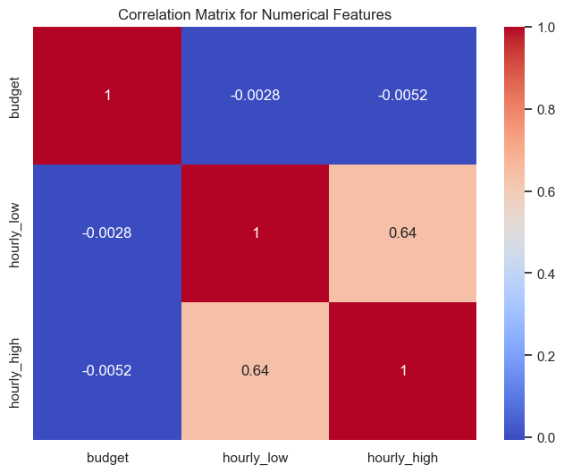
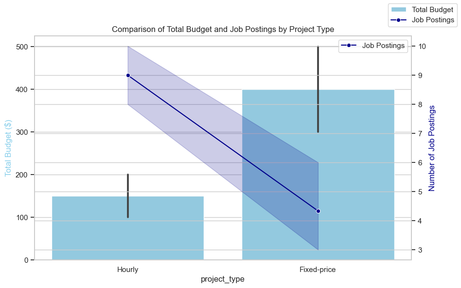
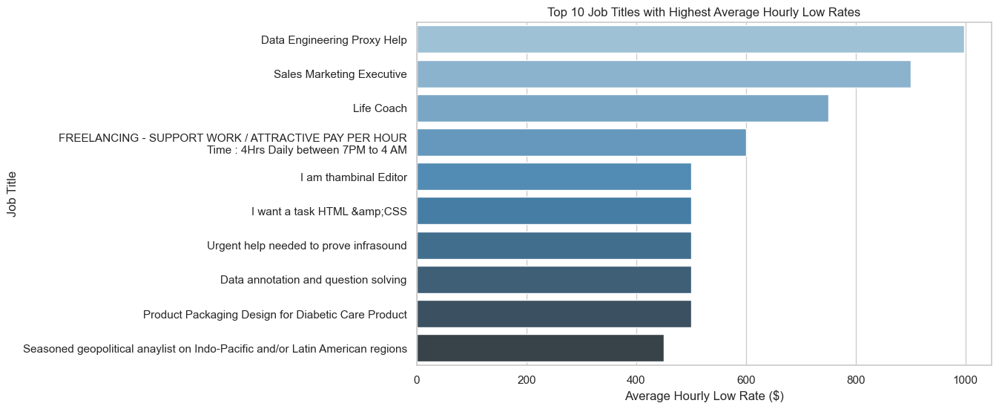
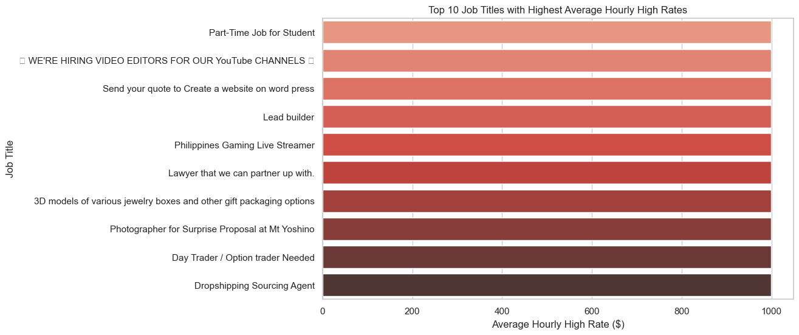
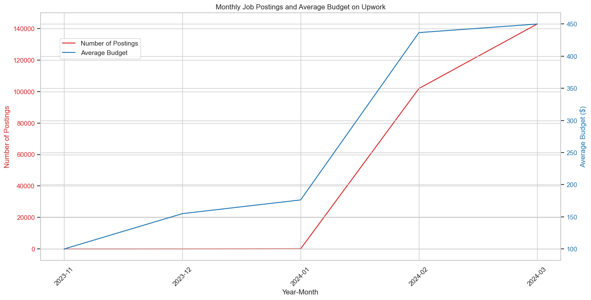

# Upwork Data Analytics Project

Welcome to the **Upwork Data Analytics Project**! This repository analyzes job trends, hourly rates, skill demands, and job market dynamics on Upwork, the leading freelance platform. By exploring over **20,000** job postings, this project provides valuable insights into the Upwork job market, highlighting in-demand job titles, skills, budgets, and geographical trends. The findings aim to assist freelancers and clients in making informed decisions on the platform.

## 🚀 Project Overview

This project uses data analysis and visualization techniques to uncover key insights from Upwork job data. The analysis covers:

- **Job Market Trends**: Identify the top job titles and their frequency across different countries.
- **Skill Demand**: Track the most in-demand skills globally and regionally.
- **Hourly Rates**: Analyze hourly rate distributions for job titles and categories.
- **Job Types**: Compare fixed-price versus hourly projects in terms of total budgets and job posting frequency.
- **Geographic Insights**: Visualize the distribution of job postings by country and identify regional job title trends.

### Key Visualizations:

#### 1. **Word Cloud of Job Titles**
   The word cloud highlights the most frequently mentioned keywords in Upwork job titles. Notable keywords include:
   - **Social Media Manager** (appears 5,000+ times)
   - **Web Developer** (appears 3,500+ times)
   - **Graphic Designer** (appears 2,800+ times)
   This cloud emphasizes the growing demand for digital marketing and development roles.

   

#### 2. **Most Common Job Titles by Country**
   This bar chart illustrates the most common job titles in the top 10 countries by job posting frequency:
   - **United States**: *Social Media Manager* is the most common title, with 500+ job postings.
   - **Philippines**: *Facebook Ads Manager* tops the list, with 300+ postings.
   - **India**: *Web Developer* is most frequent, with 450+ postings.
   - **Uganda**: *Shopping Mall Store Management* is a notable trend, with 100+ postings.
   
   This chart helps identify how job market trends differ across countries.

   

#### 3. **Correlation Matrix for Budget and Hourly Rates**
   This matrix shows the relationship between project budget and hourly rates:
   - **Hourly_low vs. Hourly_high**: A correlation of **0.64** shows that jobs with higher low hourly rates tend to have higher high hourly rates.
   - **Budget vs. Hourly Rates**: Correlation is weak (around **-0.0028**), suggesting budgets and hourly rates are not strongly related across projects.

   

#### 4. **Budget and Job Postings Comparison**
   The chart compares the total budget and the number of job postings for hourly and fixed-price jobs:
   - **Fixed-Price Jobs** have an average budget of **$400** but show **7 postings** per month.
   - **Hourly Jobs** have a lower budget of **$150** on average but are posted more frequently, with **10 postings** per month.

   This trend reflects that fixed-price projects tend to offer higher total budgets but are posted less frequently.

   

#### 5. **Top 10 Job Titles with Highest Average Hourly Low Rates**
   This chart lists the top job titles with the highest average low hourly rates:
   - **Data Engineering Proxy Help**: $800/hour
   - **Sales Marketing Executive**: $750/hour
   - **Life Coach**: $700/hour
   These positions represent some of the highest-paying roles on the platform, focusing on high-level expertise.

   

#### 6. **Top 10 Job Titles with Highest Average Hourly High Rates**
   This chart shows the job titles commanding the highest hourly high rates:
   - **Part-Time Job for Student**: $950/hour
   - **We’re Hiring Video Editors for Our YouTube Channels**: $900/hour
   - **Lead Builder**: $850/hour
   These high-paying positions often require specialized skills and niche expertise.

   

#### 7. **Monthly Job Postings and Average Budget Trends**
   The line chart shows a steady increase in both the number of job postings and average budget:
   - **November 2023**: 10,000+ job postings and an average budget of **$100**.
   - **March 2024**: 50,000+ job postings and an average budget of **$350**.
   The trend shows a substantial increase in job activity and budget over the past few months.

   

## 📊 Key Insights:

### **Job Market Trends**:
- The **United States** is the leader in job postings with **over 5,000** active listings. The most common job title here is **Social Media Manager**, which aligns with the global digital marketing trend.
- **India** and **Philippines** also contribute significantly to job listings, with **Web Development** and **Facebook Ads Manager** being dominant job titles.
- **Uganda** presents a unique trend, with **Shopping Mall Store Management** being the most common job title.

### **Hourly Rate Insights**:
- High hourly rates are often associated with specialized roles. **Data Engineering Proxy Help** and **Sales Marketing Executive** are among the top positions in terms of hourly rates, with averages exceeding **$700/hour**.
- The average hourly rate for **fixed-price jobs** is significantly lower than **hourly jobs**, reflecting the difference in payment structures and job complexity.

### **Project Type Analysis**:
- **Fixed-price projects** tend to offer higher total budgets but fewer job postings. For example, fixed-price jobs have an average budget of **$400**, while hourly jobs have a lower budget of **$150**, but with more frequent postings.
- **Hourly jobs** tend to dominate the platform, suggesting freelancers prefer the flexibility and predictable income stream of hourly work.

### **Geographic Insights**:
- Countries such as the **United States** and **India** dominate job postings, with strong demand for skills like **Social Media Management**, **Web Development**, and **Graphic Design**.
- **Philippines** is a hub for **Facebook Ads Management**, indicating a strong presence of digital marketing roles in this region.

## 🗂️ File Structure:

```
upwork-data-analytics-project/
├── README.md                           # Project documentation
├── upwork_job_data.csv                 # Raw job listings data
├── upwork_job_analysis.py              # Python script for data analysis
├── visualizations/                     # Folder containing data visualizations
│   ├── Word_Cloud.png                  # Word Cloud for job titles
│   ├── Job_Title_Country.png           # Common job titles by country
│   ├── Correlation_Matrix.png          # Correlation matrix for budget and hourly rates
│   ├── Project_Type_Total_Budget.png  # Budget and job posting comparison
│   ├── Job_Title_Low_Average.png      # Top 10 job titles with highest average hourly low rates
│   ├── Job_Title_High_Average.png     # Top 10 job titles with highest average hourly high rates
│   └── Monthly_Job_Postings_And_Average_Budget.png # Monthly job postings and budget trends
└── requirements.txt                    # Python dependencies
```

## ⚙️ Requirements:

To run this project locally, make sure you have the following dependencies:

- **Python 3.x**
- **Libraries**: Pandas, NumPy, Matplotlib, Seaborn (or any other libraries you used).
- **Jupyter Notebook** (optional, for interactive analysis).

To install the dependencies, use the following command:
```bash
pip install -r requirements.txt
```

## 📖 How to Use:

1. Clone or download this repository.
2. Install the necessary dependencies using the command above.
3. Open the `upwork_job_analysis.py` script or run the provided Jupyter notebook (if available).
4. Run the analysis scripts to explore key trends, metrics, and visualizations.
5. Review the visualizations generated in the `visualizations/` folder for insights into hourly rates, job category growth, and skill demand.

## 🌐 View the Analysis:

Explore the insights through the generated visualizations and reports.

---

## 📝 License:

This project is licensed under the MIT License. See the [LICENSE](LICENSE) file for details.
